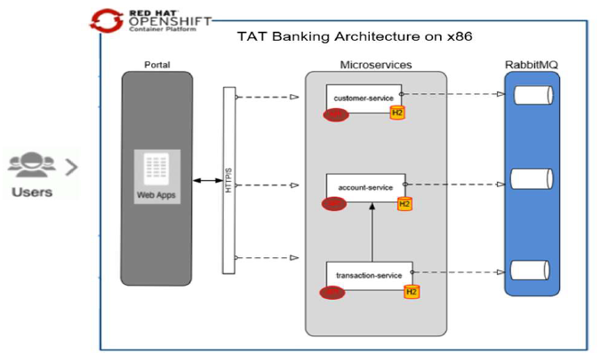

## Summary
This Code pattern describes a step-by-step and best practice approach for migrating an existing x86 application container to LinuxONE on Red Hat OpenShift 4.4 using Multi-architecture. This Code Pattern focuses on deploying OpenShift Container using multi-architecture and provides a validated process for deploying a production ready OpenShift Container Platform Cluster on LinuxONE.

## Description
TAT Banking is a conceptual online retail banking web application based on microservice architecture and it is designed to demonstrate a rehost or lift and shift approach to migration application container to LinuxONE on RedHat OpenShift without any modifications in the code. The approach involves lifting the whole application from RedHat OpenShift on x86 environment to RedHat OpenShift on LinuxONE 
environment.

This code pattern  provides the following microservices for the TAT Banking application:

* Portal-UI
* Customer-service 
* Account-Service
* Transaction-Service
* RabbitMQ
 
## Flow

1. Portal Container

The portal container is a front-end application based on Spring web MVC framework and consist of POJO objects that are processed by
Microservices containers and POJO are persisted in Memory. For this application we are not using any distributed databases.

2. Microservice Container

The microservice container module is responsible to process the business logic and it is written based on Axon framework which is an
opensource that provides Java API for writing Command Query Responsibility Segregation (CQRS). The main idea behind CQRS pattern is
to divide data store into two parts, the first part serves only for performing in insert, update, and delete and that is called command, and the other part serves only for selecting queries. There are three microservices, Customer-service, Account-service, and Transaction-service and each of them used an in-memory database called H2 which primarily relies on memory for data storage.

The event source is ensuring every change to the application is capture in an event object.

3. Integration Container 

The Integration Container Module used RabbitMQ as a messaging service hub to keep both interfaces (Command and Query) in sync.

## Instructions

Ready to get started? Check out the [README](https://github.ibm.com/Antoine-Fievre/tat-banking-demo/blob/master/README.md "README") for detailed instructions on how to:

1. Build TAT-Banking custom docker image for LinuxONE
2. Install Manifest tool
3. Create Multi-architecture Images for TAT-Banking
3. Deploy TAT-Banking Application Using Multi-Architecture Images
3. Test TAT-Banking Application

## Next Steps
Use the source code in github and instructions in the readme file to understand the steps we followed to build and migrate the TAT Bank application to LinuxONE on RedHat OpenShift 4.4:

* Source Code: [TAT Banking Source Code](https://github.ibm.com/Antoine-Fievre/tat-banking-demo/ "github")
* Article:  [An introduction to OpenShift 4.4](https://developer.ibm.com/articles/intro-to-openshift-4/ "openshift")
* Article:  [Manifest Tool](http://containerz.blogspot.com/2016/07/multi-arch-registry.html "tool")
* Article:  [Red Hat Universal Base Image 8](https://github.com/OpenLiberty/ci.docker#building-an-application-image "tool")
* Tutorial: [Install OpenShift 4 on LinuxONE](https://developer.ibm.com/tutorials/install-red-hat-openshift-on-ibmz-linuxone/ "linuxone")

## License
This code pattern is licensed under the Apache License, Version 2. Separate third-party code objects invoked within this code pattern are licensed by their respective providers pursuant to their own separate licenses. Contributions are subject to the [Developer Certificate of Origin, Version 1.1](https://developercertificate.org/) and the [Apache License, Version 2](https://www.apache.org/licenses/LICENSE-2.0.txt).

[Apache License FAQ](https://www.apache.org/foundation/license-faq.html#WhatDoesItMEAN)

