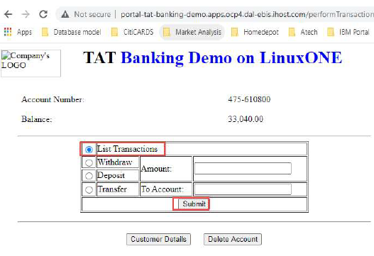

## Migrate Linux application containers from x86 to IBM LinuxONE on Red Hat OpenShift 4.4 using Multi-Architecture

## Summary
This Code pattern describes a step-by-step and best practice approach for migrating an existing x86 application container to LinuxONE on Red Hat OpenShift 4.4 using Multi-architecture. This Code Pattern focuses on deploying OpenShift Container using multi-architecture and provides a validated process for deploying a production ready OpenShift Container Platform Cluster on LinuxONE.

## Why IBM LinuxONE for Red Hat OpenShift?

IBM LinuxONE offers flexible compute with horizontal scalability on a single system that can grow to thousands of Linux guests and millions of containers. As well as vertical scalability that can non-disruptively grow databases without requiring any partitioning or sharding while maintaining response times and throughput.

In addition,  IBM LinuxONE provide advanced security for confidential cloud computing, including FIPS 140-2 Level 4 certification and maximum isolationthat meets Common Criteria EAL5+. Secure Key technology with built-in tamper proof security, includingtamper sensing and tamper-responding to zeroize keys when attacked. As well as cryptographic cards and co-processors to perform encryption functions.

RedHat OpenShift is built on Kubernetes platform with portability in mind. 4.x version supports multiple architectures, including IBM LinuxONE/IBM Z and IBM Power. On top of it, IBM is making Cloud Paks available with multi-architctural support. Both stacks can be deployed on premises as an untethered private cloud, while offering public cloud flexibility and experience. RedHat OpenShift provides a layer of abstraction for the choice of differentcloud vendors and infrastructures.

RedHat OpenShift provides enterprise scale Kubernetes benefits from leading practices and support. Deploying and developing on Kubernetes involves a lot of complexities. Most of which are simplified in OpenShift, including selection ofa Linux operating system, Container Runtimes(CRI-O, Containerd, Docker, etc), image registry, software defined networking, load-balancer, routing, log management, container metrics, monitoring, etc. OpenShift includes all these components fully integrated and fully tested as part of the platform.

## Migration Architecture Flow


# Pre-requisites

1. Log in, or create an acccount on [IBM LinuxONE Community Cloud](https://developer.ibm.com/components/ibm-linuxone)
2. Red Hat OpenShift Cluster 4.4 or Higher
2. Download and install [Maven version 3.6.3 or Higher](https://maven.apache.org/ "maven")
3. Download and install [Git](https://git-scm.com/ "git")


## Steps

1. [Clone the TAT-Banking Repository Locally](#1-clone-the-repository-locally).
2. [Build TAT-Banking custom docker image for LinuxONE](#2-install-docker-community-edition).
3. [Install Manifest tool](#3-install-manifest-tool).
4. [Create Multi-architecture Images for TAT-Banking](#4-create-multi-architecture-images).
5. [Pre-build Container Image for TAT-Banking](#5-pre-build-comtainer-image).
6. [Deploy TAT-Banking Application Using Multi-Architecture Images](#6-deploy-tat-banking-application-using-multi-architecture-images).
7. [Test TAT-Banking Application](#7-test-tat-banking-application).


### 1. Clone the tat-banking repository locally

Clone down this `TAT-Banking` repository on your LinuxONE environment.

 **Note:** Please make sure you login to your LinuxOne environment to complete these steps below. Also if don't want to pull the TAT-Banking Application code from github and build the docker images for LinuxONE then you can skip `Step 1` through `Step 4`
 
```
$ git clone https://github.com/IBM/TAT-Banking.git
```

### 2. Build TAT-Banking custom docker image for LinuxONE

The custom Dockerfile for each service uses a Universal Base OS Image which is supported amd64, s390x, and ppc64e architectures.

Follow the steps outline below to clone the repo, build docker images, tag and push the images to dockerhub: 


       1. Change to the directory where you clone the repo 
          
           $ cd TAT-Banking/
          
              
      2. Execute this maven command below to build the tat-banking application binaries 
          
           $ mvn clean package
                          
      3. If the build is successful, then copy the binaries as showing below
         
           $ cp customer-service/target/customer-service-1.0-SNAPSHOT.jar TAT-Banking/docs/build/customer
           $ cp account-service/target/account-service-1.0-SNAPSHOT.jar TAT-Banking/docs/build/account
           $ cp transaction-service/target/transaction-service-1.0-SNAPSHOT.jar TAT-Banking/docs/build/transaction
           $ cp portal/target/portal-1.0-SNAPSHOT.war TAT-Banking/docs/build/portal
         
      4. Change to the build directory as shown below 
         
         $ cd docs/build/customer
         
      5. Execute docker build command below to build the customer images 
         
         $ docker build -t customer-ubi:v0.1 .
         
      6. Execute docker tag command to tag the images that just created 
         
         $ docker tag customer-ubi:v0.1 <your-docker-account>/customer-ubi-s390x:v0.1
         
      7. Execute docker push command to push the image into dockerhub 
         
         $ docker push <your-docker-account>/customer-s390x:v0.5  
         
      8. Repeat step 1-8 above to build the docker images for account-service, transaction-service, and portal. For rabbit service, repeat step 4-7.    
       
### 3. Install Manifest tool

For TAT Banking we use a manifest tool to create multi-architure images, the manifest-tool is a command line utility that implements a portion of the client side of the Docker registry v2.2 API for interacting with manifest objects in a registry conforming to that specification. The manifest tool can be installed on Linux x86 or LinuxONE.

 To install the manifest tool, please follow the installations steps [here](http://containerz.blogspot.com/2016/07/multi-arch-registry.html).
 
 ### 4. Create Multi-architecture Images for TAT-Banking
 
 Multi-architecture image allows you to put several images behind a common identifier in a registry and that called Manifest list, with this approach a consumer of the image won't have to think about pulling the right binary flavor of the image, it's done right automatically for him.
When a container is started from a multi-arch image, OpenShift selects and uses the image that matches the architecture of the OpenShift
host.

We have already created variant image for our TAT Banking application that will serve two different architectures (x86 and s390x). First
thing we will need to do is to enable Manifest tool and assemble the images into a manifest list. To download the manifest deployment files, click [here](https://github.com/IBM/TAT-Banking/tree/master/docs/manifest-list).

Follow the steps outline below to create Multi-Architecture image lists: 

    1. Login into the server where you install the manifest-tool and and download the manifest configuration files to a temp directory and  execute the following commands to create Multi-Architecture image for each service.
 
       a. Create manifest list for customer-service
          $ manifest push from-spec customer-v0.1.yml
      
          Then use this command to inspect the manifest list
          $ manifest inspect tonyfieit/customer:v0.1    
            
       b. Create manifest list for account-service
          $ manifest push from-spec account-v0.1.yml
      
          Then use this command to inspect the manifest list
          $ manifest inspect tonyfieit/account:v0.1    
      
       c.  Create manifest list for transaction-service
           $ manifest push from-spec transaction-v0.1.yml
      
           Then use this command to inspect the manifest list
           $ manifest inspect tonyfieit/transaction:v0.1  
      
       d.  Create manifest list for portal
           $ manifest push from-spec portal-v0.1.yml
      
           Then use this command to inspect the manifest list
           $ manifest inspect tonyfieit/portal:v0.1  
      
       e.  Create manifest list for rabbit-service
           $ manifest push from-spec rabbit-v0.5.yml
      
           Then use this command to inspect the manifest list
           $ manifest inspect tonyfieit/rabbit:v0.5  
  
  ### 5. Pre-build Container Image for TAT-Banking

The TAT Banking application has the following images built and available for both x86 and s390x on dockerhub. If you don't want to deal with the tat-banking applicationn code and don't want to build container images then you can use the multi-arch images listed from the screen shot below to deploy the application on LinuxONE. To deploy the tat-banking application, please go to `Step 6`.

If you complete `Step 1` through `Step 4` then go to `Step 6`.


### 6. Deploy TAT Banking Application Using Multi-Architecture Images

We created the multi-architecute images for TAT Banking, now let us use it to deploy the application into OpenShift.
The following [artifacts](https://github.com/IBM/TAT-Banking/tree/master/docs/deployment) will be needed to complete the deployment of TAT-Banking application On Red Hat OpenShift.
 
 * Customer.yaml
 * Account.yaml
 * Transaction.yaml
 * Portal.yaml
 * Rabbit.yaml
 * Deploy.sh

Follow the steps outline below to deploy the TAT Banking application on Red Hat OpenShift:

       1. Login to your Linux environment and execute the command below to login to OpenShift 
          
           $ oc login –token=<koken> --server=https://api.<clusterid>.<domain>:6443
          
       2. Clone the tat-banking repos(if repo is already cloned then no need to clone it again, proceed to step 3) 
         
           $ git clone https://github.com/IBM/TAT-Banking.git
          
       3. Change to the directory where you clone the repo
          
           $ cd TAT-Banking/docs/deployment
                          
       4. Run the Deploy.sh script
         
           $ ./deploy.sh
                   
       5. Use oc project command to change to the project namespace
         
         $ oc project tat-banking-demo
         
       6. Run oc get command to list all the pods running under the project
         
         $ oc get pods
         
       7. If everything goes well, then you should see the Status for each pod listed as Running
  

### 7. Test TAT-Banking Application

After a successful deployment, lets test out our TAT-Banking Application. To test the application, we will use the following test cases:

* Test Case 1: Create a customer using swagger API
* Test Case 2: Create an account for the Customer using the customer Social Security Number
* Test Case 3: Deposit amount to the account
* Test Case 4: Withdraw amount from the account
* Test Case 5: List All transactions on the account


###### 1. `Test Case 1` - Create a customer using swagger API
 
 For TAT Banking application, we implemented swagger API for each microservice, we will use swagger to make api call to Customer container service to create a customer profile.

Follow the steps outline below to create a customer:

a. Login to `OpenShift web Console` and click `> tat-banking-demo>networking>route and click customer link and click the url` and once
the browser launch with the url add /swagger-ui.html at the end. The url should have the same format as this example url listed below.

 
 
  

b. Click createCustomer and type firstname, lastname, title and click execute link to submit the request

 
 
c. If the request is successful, then the customer is created and a ss# is returned as a response back to the client
 
 

c. Now the customer is created, and we will use the customer social security number to create the account

###### 2. `Test Case 2` - Create an account for the Customer using the customer Social Security Number

Follow the steps outline below to create a customer account
a. Login to `OpenShift web Console` and click > `tat-banking-demo>networking>route and click portal route and click on the url` and
once the browser launch, you should see a page like this


 
 
 
b. Enter the customer SS# 564-86-88659 and click submit and if the request is successful then you should see a page as showing
below


c. Click Add account to create the account


d. Now an account has been created for the customer. Let’s make a deposit

###### 3. `Test Case 3` - Deposit amount to the account

Follow the steps outline below to make a deposit to account:

a. Click on `account number`, enter the `amount` you want to deposit and select `Deposit` and click `submit`


b. Now a deposit has been made to the account and you should see a page as showing below


###### 4. `Test Case 4` - Withdraw amount from the account

Follow the steps outline below to make a withdraw:

a. Let’s make a withdraw, enter the `amount` you want to withdraw and select `Withdraw`


b. Now the withdraw has been made


###### 5. `Test Case 5` - List All transactions on the account

Follow the steps outline below to list all transactions from the account:

a. To list the transaction, select `list transaction` and click `submit`



b. The list transaction is listed from the screen shot below. We can see the date that the deposit and withdraw were made.


 
## License
This code pattern is licensed under the Apache License, Version 2. Separate third-party code objects invoked within this code pattern are licensed by their respective providers pursuant to their own separate licenses. Contributions are subject to the [Developer Certificate of Origin, Version 1.1](https://developercertificate.org/) and the [Apache License, Version 2](https://www.apache.org/licenses/LICENSE-2.0.txt).

[Apache License FAQ](https://www.apache.org/foundation/license-faq.html#WhatDoesItMEAN)
